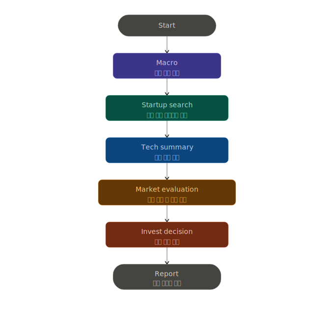

# AI Startup Investment Evaluation Agent
본 프로젝트는 로보틱스(Robotics) 스타트업에 대한 투자 가능성을 자동으로 평가하는 에이전트를 설계하고 구현한 실습 프로젝트입니다.

## Overview

- Objective : 로보틱스 스타트업의 기술력, 시장성, 거시경제 환경 등을 기준으로 투자 적합성 분석
- Method : AI Agent + Agentic RAG 
- Tools : LangGraph, LangChain, FAISS, PyMuPDFLoader, PDFPlumber, Tavily Search API

## Features

- PDF 자료 기반 정보 추출 (한·영·중 3개 국어 글로벌 PDF 데이터 파싱 및 정보 추출)
- 투자 기준별 판단 분류 (기술 스택, 시장 규모 산출, 매크로 지표 등)
- 종합 투자 요약 출력 (지표 평가 후 Go: 투자/ Watch: 보류 / Pass: 기각 등급 판정 및 최종 심사 보고서)

## Tech Stack 

| Category   | Details                           |
|------------|-----------------------------------|
| Framework  | LangGraph, LangChain, Python 3.11 |
| LLM        | gpt-4o via OpenAI API             |
| Retrieval  | FAISS (Hit Rate@K, MRR)           |
| Embedding  | Qwen/Qwen3-Embedding-0.6B         |

## Agents
 
- Startup Search Agent: 웹 검색 및 문서를 통한 로보틱스 스타트업 기본 정보 수집
- Tech Summary Agent: RAG 기반 핵심 로봇 기술 및 기술적 해자 분석
- Market Eval Agent: RAG 기반 타겟 시장 규모(TAM/SAM/SOM) 및 수요 동인 분석
- Macro Market Agent: 시장흐름, 정부 정책 등 거시 경제 흐름 분석
- Investment Decision Agent: 세부 지표 총점 산출 및 최종 등급 (Go / Watch / Pass) 분류
- Report Writer Agent: 영문 분석 결과를 바탕으로 한국어 투자 심사 보고서 작성

## Architecture



## Directory Structure
``` Plain text
├── data/                  # 로보틱스 스타트업 및 산업 분석 PDF 문서
├── agents/                # 평가 기준별 Agent 모듈
├── prompts/               # 프롬프트 템플릿
├── output/                # 평가 결과(reports) 및 VectorDB 인덱스(vectordb) 저장
├── main.py                # 실행 스크립트
└── README.md
```

## Contributors 
- 김지온 : 입력 키 정의 및 투자 가이드라인 Metrics 설계, 프롬프트 입력 키 정의 및 시스템 프롬프트 엔지니어링
- 김철희 : End-to-End Query 파이프라인 설계 및 전체 아키텍처 조율, LangGraph Node 연결
- 박소윤 : 타겟 스타트업 문서 조사, PDF Loading 및 FAISS 기반 VectorDB 인덱싱, 임배딩 전담
- 서제임스 : 아키텍처 설계, LangGraph Node 생성 및 상태 연결, LangSmith 연동 및 에러 디버깅
- 최유진 : 프롬프트 입력 키 정의 및 시스템 프롬프트 엔지니어링, VectorDB 임베딩 보조